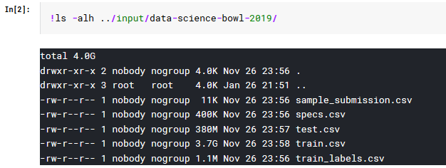
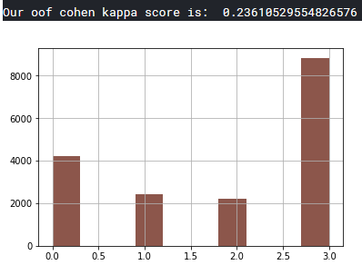

# Machine Learning Engineer Nanodegree

## Capstone Project Report
Ravi Kandikonda
Jan 26th 2020

## I. Definition
### Project Background
Early childhood education research is conducted by many reputed organizations. PBS Kids is one such organization trying to gain deep insights into how modern media helps young children learn important skills needed for success in life. They use unique measuring games and measurement-focused video clips that feature well-known PBS characters to teach the concepts and also reward them as needed. Data Science Bowl (https://datasciencebowl.com/) is conducting a challenge on Kaggle in which participants have to predict certain scores that will aid PBS in devising higher quality educational media and improved learning processes. Of the many challenges presented on Kaggle, I chose this one due to my interest in early childhood education and providing the right kind of tools and resources to kids to help them relaize their potential sooner.

### Problem Statement
The Kaggle challenge provides anonymous gameplay data which includes the information about the video clips that were watched by the kids and the games that they played while using the PBS Kids Measure Up! app. In this app the children who are aged between 3 and 5 learn early STEM concepts like length, width, capacity and weight while experiencing an adventure-like gameplay through Treetop City, Magma Peak and Crystal Caves. They collect rewards along the way and can unlock digital toys during their play. The challenge is to predict the scores on the in-game assessments and create an algorithm that will lead to better game design and improve learning outcomes. The challenge has been open for several weeks and they have published a live leaderboard online. The solution is scored using a quadratic weighted kappa, which measures the agreement between two outcomes.

More details about the scoring are available here. https://www.kaggle.com/c/data-science-bowl-2019/overview/evaluation

### Dataset and Inputs
The data comes from the PBS Kids Measure Up! app. As the child uses the app to navigate a map while playing games, watching video clips and completing various levels, data is collected and anonymized in accordance with child privacy regulations. This is presented in a tabular form containing the child's interactions within the app, such as the in-app assessment score or their path through the game and certain analytics. The assessments are designed to test the child's comprehension of a certain set of skills. The game presents five assessments: Bird Measurer, Cart Balancer, Cauldron Filler, Chest Sorter, and Mushroom Sorter.

The challenge provides two main data file (train.csv and test.csv) each of which contain the gameplay events with the following features:

    event_id: Randomly generated unique identifier for the event type.
    game_session: Randomly generated unique identifier grouping events within a single game or video play session.
    timestamp: Client-generated datetime
    event_data: Semi-structured JSON formatted string containing the events arameters. Default fields are: event_count, event_code, and game_time; therwise fields are determined by the event type.
    installation_id: Randomly generated unique identifier grouping game sessions within a single installed application instance.
    event_count: Incremental counter of events within a game session (offset at 1). Extracted from event_data.
    event_code: Identifier of the event 'class'. Unique per game, but may be duplicated across games. E.g. event code '2000' always identifies the 'Start Game' event for all games. Extracted from event_data.
    game_time: Time in milliseconds since the start of the game session. Extracted from event_data.
    title: Title of the game or video.
    type: Media type of the game or video. Possible values are: 'Game', 'Assessment', 'Activity', 'Clip'.
    world: The section of the application the game or video belongs to. Helpful to identify the educational curriculum goals of the media. Possible values are: 'NONE' (at the app's start screen), TREETOPCITY' (Length/Height), 'MAGMAPEAK' (Capacity/Displacement), 'CRYSTALCAVES' (Weight).

The training set contains 11341042(~11.3M) records. It has 11 columns as shown in the figure below. 

The testing set contains 1156414(1.1M) records and has 11 columns as can be seen from the image below.

Since the testing set doesnt give the correct answers I will create a validation set and most likely use KFold cross-validation to to evaluate the model's fit using the generated score.

The dataset contains another file specs.csv which gives the specification of the various event types.

The dataset also includes a file train_labels.csv which demonstates how to compute the ground truth for the assessments in the training set.

## II. Data Analysis and Exploration
The inputs to the problem are a set of files provided by kaggle.com on its competition website.

These files contain data that has the following structure.

Taking a deeper look, I notice that there are 3614 unique installation ids in the training data which have their correct target variable in the train_labels dataset. We need to train a model on the training data and then validate against the ground truth provided in the labels.

From the image above we can see that the target variable 'accuracy_group is provided for each unique combination of an installation_id+game_session. It helps to know this when we are compiling data from the training_data. 

Now lets compile some data from the training dataset.

### Data Preprocessing
In the preprocess, step, I step through each game_session grouped by the installation id and collect the 'true' and 'false' attempts made by the child in each Assessment exercise. I tally them and calculate a total correct vs false and and accumulated list of attempts and scores. 

Full code canbe accessed at the github link given below:
https://github.com/gr8ergud/Udacity-MLND-Capstone-Project/blob/master/capstone.ipynb

The 'build_features' method translates the raw data into trainable data by extracting relevant features. 

I selected a notebook on teh kaggle.com website as a starting point and started making changes that I thought would be needed to get a benchmark, a solution and other analyses peformed. Some of the algorithms used in the source kernel were kept intact but I heavily modified it suit the nanodegree requirements.
https://www.kaggle.com/braquino/convert-to-regression

### Feature Engineering
To reduce or optimize teh number of features, I have searched for columns that have only '0' in the cells and removed those columns as tehy donta provide any value to the training.

The above action resulted in around 850 labels in the trainbale dataset. All the categorical lables were already mapped and converted to numericals and also one-hot encoded during the feature extraction step. 

### Cross Validation
For cross validation I picked the StratifiedKFold cross validation and used n_folds=5 to reduce overfitting of the model. 

### Evaluation Metric
To compare the solution's model with a benchmark, the quadratic weighted kappa score was selected. 

## III. Benchmark
I picked the Logistic Regression model to benchmark against my solution. I trained the model on the same set of data that I used for the main solution.
The full code is available here: https://github.com/gr8ergud/Udacity-MLND-Capstone-Project/blob/master/capstone.ipynb

The quadratic weighted kappa score for the benchmark turned out to be 0.237 (1 is full agreement with the ground truth). The distribution of the predicted scores for the test data is plotted in the graph below.

## IV. Solution
For the solution I selected teh LightGBM estimator which has a few advantages over the XGBoost and other neural network based architectures in speed, memory usage etc., 

## Results

